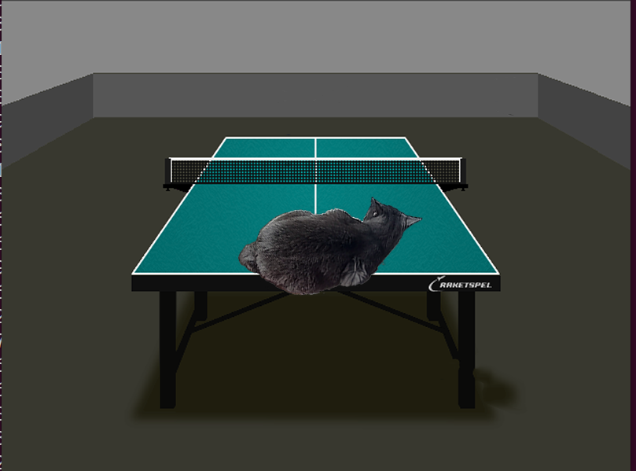

# Alpha blending optimization
## General information
This repository is the next step of "SIMD optimizations" lab. It is dedicated to alpha blending algorithm (and to cats), which I have optimized by using SSE instruction set.

## Result of Alpha Blending

## Simple algorithm
The main idea of alpha blending is to blend two RGBA pictures using the formula below:

~~~C++
Front_CLR = Front_CLR * Front_Alpha + Back_CLR * (1 - Front_CLR)
~~~
In simple algorithm I am iterating by every pixel of front image, and use the alpha blending formula.
## Optimization
To optimize the algorithm, I use the SIMD instructions and calculate four pixels in one iteration.

## Measurements
I measure time, using ```sf::Clock```.

| Compilation flags | Optimization | FPS | Performance |
|-------------------|--------------|-----|-------------|
| -O0               |     None     | 400 |     0.27.   |
| -Ofast            |     None     | 1500|     1       |
| -Ofast            |     SSE      | 5500|     3.67    |

The ```-Ofast``` and ``` -O2 ``` has the same FPS in this task, so I put ```-Ofast``` results in table.

The performance boost is $5500/1500 = 3.67$ times.

## Conclusion
Optimization is a very hard task. The compiler does it, but in some cases we need to do optimization by our own and SIMD instruction is useful instrument for this.
By this method I increased performance in $3.67$ times and the result worth it.
